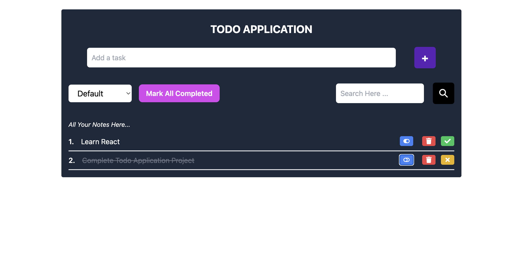

# 📝 Todo Application

## 🚀 Overview

This **Todo Application** is a simple and efficient task management tool that helps users organize and prioritize their daily tasks. Built with **React**, styled with **Tailwind CSS**, and powered by **Redux** for state management, it ensures a seamless and interactive user experience.

---

## 🌟 Features

- **Add Tasks**: Quickly add new tasks to your todo list.
- **Edit Tasks**: Modify task descriptions with ease.
- **Delete Tasks**: Remove tasks you no longer need.
- **Mark as Complete**: Track your progress by marking tasks as complete.
- **Persistent State**: Uses Redux to manage state across components efficiently.

---

## 🛠️ Tech Stack

- **React**: Frontend library for building user interfaces.
- **Tailwind CSS**: Utility-first CSS framework for responsive design.
- **Redux**: State management library.
- **Redux Toolkit**: Simplified Redux development.

---

## 📸 Screenshots

### Home Page




---


## ⚙️ Installation

Follow these steps to run the application locally:

1. Clone the repository:

   ```bash
   git clone https://github.com/your-username/todo-app.git
   ```

2. Navigate to the project directory:

   ```bash
   cd todo-app
   ```

3. Install dependencies:

   ```bash
   npm install
   ```

4. Start the development server:

   ```bash
   npm start
   ```

The application will be available at `http://localhost:3000/`.

---

## 🧑‍💻 Usage

1. **Add Tasks**: Click the "Add Task" button to create a new task.
2. **Edit Tasks**: Click on a task to edit its details.
3. **Mark Complete**: Use the checkbox to mark tasks as complete.
4. **Delete Tasks**: Click the delete icon to remove tasks.

---

## 🎨 Styling with Tailwind CSS

- Custom styles are applied using Tailwind utility classes.
- Global styles can be found in the `src/styles` folder.

---

## 🔧 Redux State Management

This application uses **Redux Toolkit** for simplified and efficient state management. The Redux slices are located in the `src/features` folder.


---

## 🤝 Contributing

Contributions are welcome! Feel free to open issues or submit pull requests for improvements and bug fixes.

---

## 📜 License

This project is licensed under the [MIT License](./LICENSE).

---

## 📧 Contact

For inquiries, reach out at [your-email@example.com](mailto:your-email@example.com).
