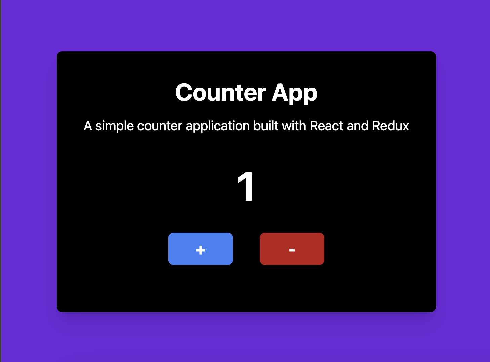

# Counter Application

A simple Counter Application built using **React** and **Redux** to demonstrate state management.

## Features

- Increment the counter.
- Decrement the counter.
- Display the current value of the counter.

---

## Demo

  

---

## Technologies Used

- **React**: For building the user interface.
- **Redux**: For state management.
- **React-Redux**: For integrating Redux with React.

---

